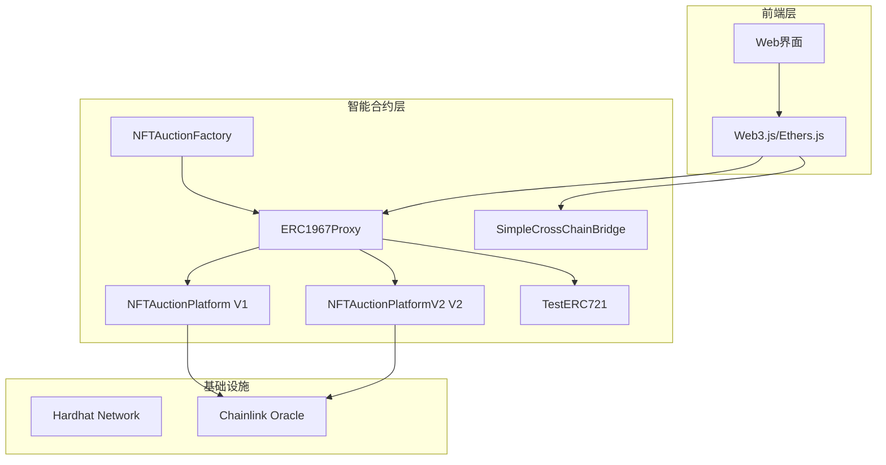

# 🏗️ NFT 拍卖平台架构文档

## 📐 系统架构概览



## 🔄 合约升级架构

```
┌─────────────────────────────────────────────────────────────┐
│                        代理架构                              │
├─────────────────────────────────────────────────────────────┤
│                                                             │
│  用户交互 → ERC1967Proxy → Implementation Contract         │
│              (不变地址)      (可升级逻辑)                   │
│                  │               │                         │
│                  │               ▼                         │
│                  │         ┌──────────┐                    │
│                  │         │    V1    │                    │
│                  │         │ 基础功能  │                    │
│                  │         └──────────┘                    │
│                  │               │                         │
│                  │        升级 (upgradeToAndCall)         │
│                  │               │                         │
│                  │               ▼                         │
│                  │         ┌──────────┐                    │
│                  └────────▶│    V2    │                    │
│                            │ 增强功能  │                    │
│                            └──────────┘                    │
│                                                             │
└─────────────────────────────────────────────────────────────┘
```

## 📊 数据流架构

### 拍卖流程数据流
```
用户操作流：
NFT Owner → mint() → approve() → createAuction()
                                      ↓
Bidder → bidWithETH() → 更新最高出价 → 触发事件
                                      ↓
任何人 → endAuction() → 转移NFT → 转移资金 → 完成拍卖
```

### 升级流程数据流
```
升级流程：
Owner → 部署V2实现 → upgradeToAndCall() → 更新存储槽 → 验证结果
   ↑                                                        ↓
   └─────────────── 权限检查 ←─── _authorizeUpgrade() ←──────┘
```

## 🗂️ 文件组织架构

```
d:\solidityTest/
│
├── 📁 contracts/task3/           # 核心合约代码
│   ├── 🔧 NFTAuctionPlatform.sol      # V1基础平台
│   ├── 🔧 NFTAuctionPlatformV2.sol    # V2增强平台
│   ├── 🏭 NFTAuctionFactory.sol       # 工厂管理
│   ├── 🌉 SimpleCrossChainBridge.sol  # 跨链桥接
│   ├── 🎨 AuctionNFT.sol             # NFT合约
│   └── 📊 MockPriceFeed.sol          # 价格预言机
│
├── 📁 scripts/                  # 自动化脚本
│   ├── 🚀 deploy-production.js        # 生产部署
│   ├── 🔄 upgrade-direct.js          # 升级脚本
│   ├── 🎮 nft-flow-demo.js           # 流程演示
│   └── 🌉 cross-chain-demo.js        # 跨链演示
│
├── 📁 test/                     # 测试文件
│   ├── 🧪 auction.js                 # 拍卖测试
│   ├── 🔄 upgrade.js                # 升级测试
│   └── 🌉 cross-chain.test.js       # 跨链测试
│
├── 📁 deployments/             # 部署记录
│   └── 📋 localhost/               # 本地部署信息
│
├── 📄 deployments.json         # 部署配置
├── 📄 hardhat.config.js        # Hardhat配置
└── 📚 文档文件
    ├── PROJECT_SUMMARY.md      # 项目总结
    ├── DEBUGGING_GUIDE.md      # 调试指南
    ├── README-PROXY.md         # 代理升级指南
    └── README.md              # 快速开始指南
```

## 🔗 合约依赖关系

```
依赖关系图：
┌─────────────────────────────────────────────────────────────┐
│                    OpenZeppelin                            │
│  ┌─ Initializable ←─ UUPSUpgradeable ←─ OwnableUpgradeable │
│  │                                                         │
│  └─ ReentrancyGuardUpgradeable                            │
└─────────────────────────────────────────────────────────────┘
                              ↑
                              │
┌─────────────────────────────────────────────────────────────┐
│                 NFTAuctionPlatform                         │
│                                                             │
│  + 拍卖逻辑 + 出价机制 + 资产转移                           │
└─────────────────────────────────────────────────────────────┘
                              ↑
                              │继承
┌─────────────────────────────────────────────────────────────┐
│                NFTAuctionPlatformV2                        │
│                                                             │
│  + V1所有功能 + 新拍卖类型 + 增强特性                       │
└─────────────────────────────────────────────────────────────┘
```

## 🛡️ 安全架构

### 权限控制层级
```
权限架构：
┌──────────────┐
│   Contract   │ 
│    Owner     │ ← 最高权限：升级合约、暂停功能
└──────────────┘
        │
┌──────────────┐
│  Platform    │ 
│   Admin      │ ← 管理权限：设置费用、管理拍卖
└──────────────┘
        │
┌──────────────┐
│    Users     │ ← 基础权限：创建拍卖、出价
└──────────────┘
```

### 安全检查点
1. **权限验证** → `onlyOwner`, `onlyAdmin`
2. **重入保护** → `nonReentrant`
3. **状态检查** → 拍卖状态、时间限制
4. **金额验证** → 出价金额、手续费
5. **地址验证** → 零地址检查、合约地址验证

## ⚡ 性能优化架构

### Gas优化策略
```
优化层级：
┌─────────────────┐
│   存储优化      │ → 批量更新、打包结构体
├─────────────────┤
│   计算优化      │ → 减少循环、优化算法
├─────────────────┤
│   事件优化      │ → 使用indexed参数
└─────────────────┘
```

### 存储布局优化
```solidity
// 优化前：分散存储
uint256 public auctionId;      // slot 0
bool public ended;             // slot 1  
address public seller;         // slot 2

// 优化后：打包存储
struct Auction {
    uint256 auctionId;         // slot 0
    bool ended;                // slot 1 (前1字节)
    address seller;            // slot 1 (后20字节)
    uint96 extraData;          // slot 1 (剩余字节)
}
```

## 🔍 监控和日志架构

### 事件体系
```solidity
// 核心事件
event AuctionCreated(uint256 indexed auctionId, address indexed seller);
event BidPlaced(uint256 indexed auctionId, address indexed bidder, uint256 amount);
event AuctionEnded(uint256 indexed auctionId, address winner, uint256 finalPrice);

// 系统事件
event Upgraded(address indexed implementation);
event CrossChainTransfer(uint64 indexed chainId, address recipient, uint256 amount);
```

### 监控指标
- 拍卖创建数量
- 总交易量
- Gas使用统计
- 升级操作记录
- 跨链转账统计

## 🚀 部署架构

### 部署流程
```
部署阶段：
开发环境 → 测试网 → 审计 → 主网
    ↓        ↓       ↓      ↓
  本地测试  → 集成测试 → 安全审计 → 生产部署
```

### 网络配置
```javascript
networks: {
    localhost: { url: "http://127.0.0.1:8545" },
    goerli: { url: "https://goerli.infura.io/v3/..." },
    sepolia: { url: "https://sepolia.infura.io/v3/..." },
    mainnet: { url: "https://mainnet.infura.io/v3/..." }
}
```

## 📈 扩展性架构

### 水平扩展
- 工厂模式：支持创建多个拍卖平台实例
- 跨链支持：扩展到多个区块链网络
- 模块化设计：可独立升级各个功能模块

### 垂直扩展
- 功能增强：V2版本添加新拍卖类型
- 性能优化：Gas优化、存储优化
- 安全加固：更多安全检查和保护机制

---

## 🎯 架构决策记录

### ADR-001: 选择UUPS代理模式
**决策**：采用UUPS而非Transparent代理
**原因**：
- Gas费用更低
- 升级逻辑在实现合约中，更灵活
- 符合最新的OpenZeppelin标准

### ADR-002: 简化跨链实现
**决策**：自实现简化版跨链桥而非集成CCIP
**原因**：
- 降低依赖复杂度
- 便于测试和调试
- 满足演示需求

### ADR-003: 直接升级方案
**决策**：采用直接调用升级函数而非依赖插件
**原因**：
- 绕过过于严格的检查器
- 提高开发效率
- 保持核心安全机制

---

*本架构文档为系统设计和未来扩展提供指导，确保项目的可维护性和可扩展性。*