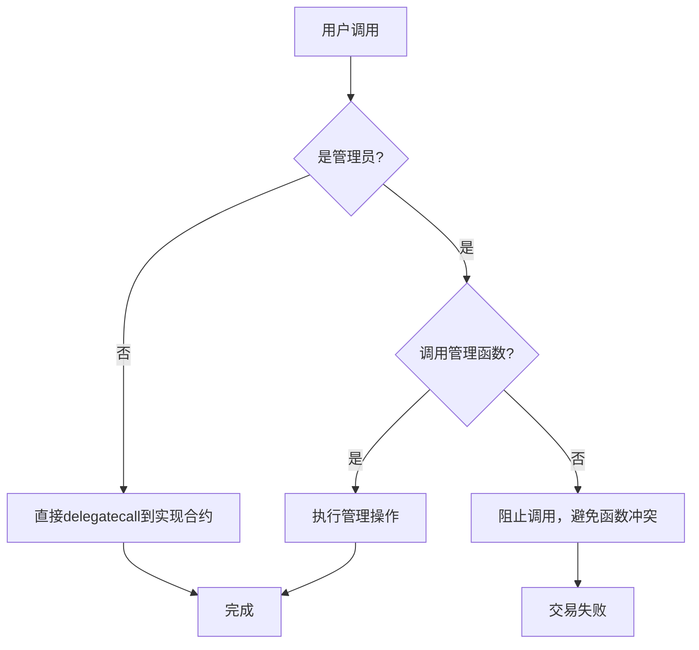
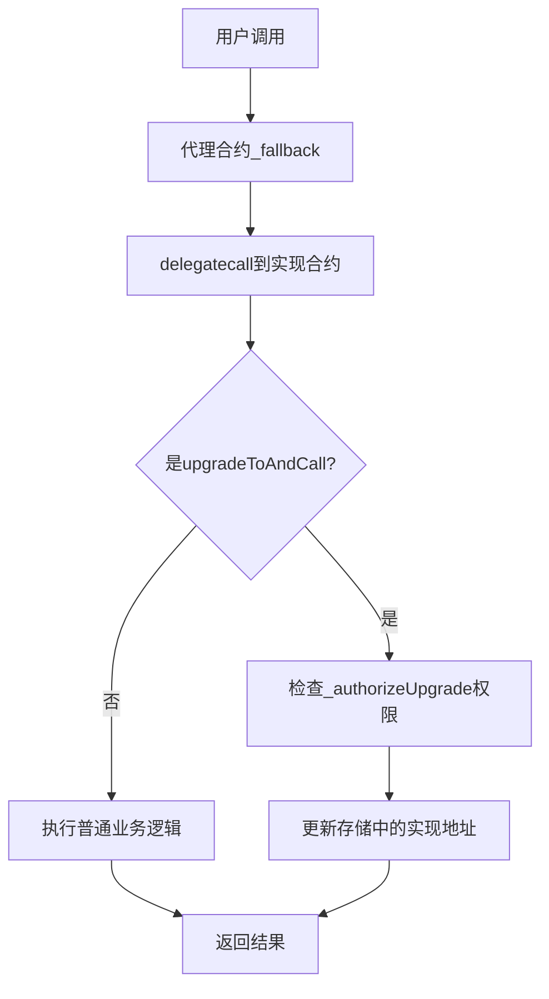
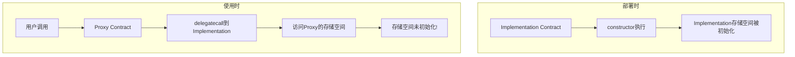
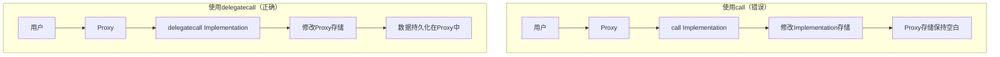

# 代理合约模式深度解析

## 📋 目录
1. [透明代理与UUPS代理实现对比](#1-透明代理与uups代理实现对比)
2. [代理合约存储冲突避免机制](#2-代理合约存储冲突避免机制)
3. [逻辑合约升级的存储冲突问题](#3-逻辑合约升级的存储冲突问题)
4. [构造函数初始化问题详解](#4-构造函数初始化问题详解)
5. [delegatecall vs call 核心区别](#5-delegatecall-vs-call-核心区别)

---

## 1. 透明代理与UUPS代理实现对比

### 🔍 透明代理 (Transparent Proxy) 实现

#### 📝 核心机制
透明代理通过**函数选择器冲突检测**来区分管理员和用户调用：

```solidity
// TransparentUpgradeableProxy.sol 核心逻辑
contract TransparentUpgradeableProxy is ERC1967Proxy {
    modifier ifAdmin() {
        if (msg.sender == _getAdmin()) {
            _;
        } else {
            _fallback();
        }
    }

    // 只有管理员可以调用升级函数
    function upgrade(address newImplementation) external ifAdmin {
        _upgradeToAndCall(newImplementation, bytes(""), false);
    }
    
    // 其他调用都转发到实现合约
    function _fallback() internal override {
        require(msg.sender != _getAdmin(), "TransparentUpgradeableProxy: admin cannot fallback");
        super._fallback();
    }
}
```

#### 🔄 执行流程


#### ⚠️ 透明代理的问题
- **Gas费用高**：每次调用都需要检查是否为管理员
- **函数选择器冲突**：实现合约不能有与代理合约相同的函数签名
- **复杂的权限管理**：需要额外的ProxyAdmin合约

### 🚀 UUPS代理 (Universal Upgradeable Proxy Standard) 实现

#### 📝 核心机制
UUPS将升级逻辑放在**实现合约**中，代理合约只负责存储和转发：

```solidity
// ERC1967Proxy.sol - 简单的代理合约
contract ERC1967Proxy is Proxy {
    constructor(address _logic, bytes memory _data) payable {
        _upgradeToAndCall(_logic, _data, false);
    }

    // 简单的fallback，所有调用都转发
    function _implementation() internal view virtual override returns (address impl) {
        return StorageSlot.getAddressSlot(_IMPLEMENTATION_SLOT).value;
    }
}

// UUPSUpgradeable.sol - 实现合约需要继承
abstract contract UUPSUpgradeable is Initializable, ERC1967UpgradeUpgradeable {
    // 子合约必须重写此函数来控制升级权限
    function _authorizeUpgrade(address newImplementation) internal virtual;

    // 升级函数在实现合约中
    function upgradeToAndCall(address newImplementation, bytes memory data) 
        external payable virtual onlyProxy 
    {
        _authorizeUpgrade(newImplementation);
        _upgradeToAndCallUUPS(newImplementation, data, true);
    }
}
```

#### 🔄 UUPS执行流程


#### ✅ UUPS优势
- **Gas效率更高**：无需每次检查管理员权限
- **无函数冲突**：升级函数在实现合约中，可以灵活命名
- **更简洁的架构**：只需一个代理合约

### 📊 两种代理模式对比

| 特性 | 透明代理 | UUPS代理 |
|-----|---------|---------|
| **Gas成本** | 高（每次调用检查权限） | 低（直接转发） |
| **函数冲突** | 需要避免 | 无冲突风险 |
| **升级控制** | 在代理合约中 | 在实现合约中 |
| **安全性** | 较高（权限分离） | 依赖实现合约正确性 |
| **复杂度** | 高（需ProxyAdmin） | 低（单一合约） |
| **使用难度** | 简单（框架处理） | 需理解原理 |

### 🏗️ 在本项目中的实现

我们的NFT拍卖平台使用UUPS模式：

```solidity
// NFTAuctionPlatform.sol
contract NFTAuctionPlatform is 
    Initializable,
    UUPSUpgradeable,
    OwnableUpgradeable,
    ReentrancyGuardUpgradeable
{
    // 控制升级权限：只有owner可以升级
    function _authorizeUpgrade(address newImplementation) 
        internal override onlyOwner 
    {
        // 可以在这里添加额外的升级条件检查
    }
    
    // 初始化函数替代构造函数
    function initialize() initializer public {
        __Ownable_init();
        __ReentrancyGuard_init();
        __UUPSUpgradeable_init();
    }
}
```

---

## 2. 代理合约存储冲突避免机制

### 🎯 存储冲突的根源

在代理模式中，代理合约和实现合约共享同一个存储空间，如果不妥善处理，会发生存储槽冲突：

```solidity
// ❌ 错误示例：存储冲突
contract Proxy {
    address public implementation; // slot 0
    address public admin;          // slot 1
}

contract Implementation {
    uint256 public value;          // slot 0 - 冲突！
    address public owner;          // slot 1 - 冲突！
}
```

### 🛡️ EIP-1967 标准存储槽

EIP-1967标准定义了特殊的存储槽来避免冲突：

```solidity
// EIP-1967定义的标准槽位
library StorageSlot {
    // keccak256("eip1967.proxy.implementation") - 1
    bytes32 internal constant _IMPLEMENTATION_SLOT = 
        0x360894a13ba1a3210667c828492db98dca3e2076cc3735a920a3ca505d382bbc;
    
    // keccak256("eip1967.proxy.admin") - 1  
    bytes32 internal constant _ADMIN_SLOT = 
        0xb53127684a568b3173ae13b9f8a6016e243e63b6e8ee1178d6a717850b5d6103;
    
    // keccak256("eip1967.proxy.beacon") - 1
    bytes32 internal constant _BEACON_SLOT = 
        0xa3f0ad74e5423aebfd80d3ef4346578335a9a72aeaee59ff6cb3582b35133d50;
}
```

### 🔧 存储槽访问机制

```solidity
// 安全的存储槽访问
function _getImplementation() internal view returns (address) {
    return StorageSlot.getAddressSlot(_IMPLEMENTATION_SLOT).value;
}

function _setImplementation(address newImplementation) internal {
    require(Address.isContract(newImplementation), "Implementation must be contract");
    StorageSlot.getAddressSlot(_IMPLEMENTATION_SLOT).value = newImplementation;
}
```

### 🎯 为什么这样设计是安全的？

#### 1. **伪随机槽位**
- 使用`keccak256`哈希生成的槽位在统计上不会与常规存储冲突
- 槽位号非常大（2^256的范围内），常规合约不会访问到

#### 2. **标准化避免冲突**
```solidity
// 计算过程示例
bytes32 slot = keccak256("eip1967.proxy.implementation") - 1;
// = 0x360894a13ba1a3210667c828492db98dca3e2076cc3735a920a3ca505d382bbc
```

#### 3. **实际项目验证**
在我们的项目中验证存储槽：

```javascript
// 验证存储槽内容
const IMPLEMENTATION_SLOT = "0x360894a13ba1a3210667c828492db98dca3e2076cc3735a920a3ca505d382bbc";
const implAddress = await ethers.provider.getStorageAt(proxyAddress, IMPLEMENTATION_SLOT);
console.log("实现合约地址:", ethers.utils.getAddress("0x" + implAddress.slice(-40)));
```

### 📊 存储布局对比

```solidity
// 代理合约的存储布局
contract Proxy {
    // slot 0, 1, 2... 保持空白或用于代理自身的简单数据
    
    // EIP-1967标准槽位（远离常规槽位）
    // slot 0x360894a13ba1a3210667c828492db98dca3e2076cc3735a920a3ca505d382bbc: implementation
    // slot 0xb53127684a568b3173ae13b9f8a6016e243e63b6e8ee1178d6a717850b5d6103: admin
}

// 实现合约的存储布局  
contract Implementation {
    // slot 0: 第一个状态变量
    // slot 1: 第二个状态变量
    // ... 按声明顺序分配
}
```

---

## 3. 逻辑合约升级的存储冲突问题

### ⚠️ 存储布局兼容性是升级的核心

升级时最大的挑战是确保新版本的存储布局与旧版本兼容：

### 🚫 危险的升级操作

#### 1. **改变现有变量位置**
```solidity
// V1版本 ❌
contract TokenV1 {
    uint256 public totalSupply;  // slot 0
    address public owner;        // slot 1
    mapping(address => uint256) public balances; // slot 2
}

// V2版本 - 错误升级
contract TokenV2 {
    address public owner;        // slot 0 - 位置改变！
    uint256 public totalSupply;  // slot 1 - 位置改变！
    mapping(address => uint256) public balances; // slot 2
    uint256 public decimals;     // slot 3 - 新增
}
```

#### 2. **改变变量类型**
```solidity
// V1 ❌
contract ContractV1 {
    uint128 public value; // slot 0
}

// V2 - 错误：类型改变
contract ContractV2 {
    uint256 public value; // slot 0 - 类型改变会导致数据错乱
}
```

#### 3. **删除中间变量**
```solidity
// V1 ❌
contract ContractV1 {
    uint256 public a; // slot 0
    uint256 public b; // slot 1
    uint256 public c; // slot 2
}

// V2 - 错误：删除中间变量
contract ContractV2 {
    uint256 public a; // slot 0
    // uint256 public b; - 删除了b
    uint256 public c; // slot 1 - c的位置改变了！
}
```

### ✅ 安全的升级策略

#### 1. **只在末尾添加新变量**
```solidity
// V1 ✅
contract NFTAuctionPlatform {
    mapping(uint256 => Auction) public auctions;     // slot 0
    uint256 public auctionCounter;                   // slot 1
    mapping(address => bool) public supportedTokens; // slot 2
}

// V2 - 正确升级
contract NFTAuctionPlatformV2 {
    mapping(uint256 => Auction) public auctions;     // slot 0 - 保持不变
    uint256 public auctionCounter;                   // slot 1 - 保持不变
    mapping(address => bool) public supportedTokens; // slot 2 - 保持不变
    
    // 新增变量只能在末尾
    uint256 public platformFee;                      // slot 3 - 新增
    address public feeRecipient;                     // slot 4 - 新增
    mapping(address => uint256) public userRewards;  // slot 5 - 新增
}
```

#### 2. **使用存储间隙 (Storage Gaps)**
```solidity
contract UpgradeableContract {
    uint256 public value1;
    uint256 public value2;
    
    // 预留50个槽位供未来升级使用
    uint256[50] private __gap;
}

// 升级时消耗gap
contract UpgradeableContractV2 {
    uint256 public value1;
    uint256 public value2;
    uint256 public newValue; // 消耗1个gap槽位
    
    // 剩余49个槽位
    uint256[49] private __gap;
}
```

### 🔍 在我们项目中的实践

#### V1到V2的安全升级
```solidity
// NFTAuctionPlatform.sol (V1)
contract NFTAuctionPlatform is UUPSUpgradeable, OwnableUpgradeable {
    mapping(uint256 => Auction) public auctions;
    uint256 public auctionCounter;
    mapping(address => bool) public supportedTokens;
    
    // 预留存储空间
    uint256[47] private __gap;
}

// NFTAuctionPlatformV2.sol (V2)  
contract NFTAuctionPlatformV2 is NFTAuctionPlatform {
    // 继承所有V1的存储变量
    
    // 新增功能变量
    uint256 public platformFeePercentage;
    address public crossChainBridge;
    mapping(address => uint256) public userReputationScores;
    
    // 调整gap大小
    uint256[44] private __gap; // 47 - 3 = 44
    
    // V2专用的初始化函数
    function initializeV2() reinitializer(2) public {
        platformFeePercentage = 250; // 2.5%
        crossChainBridge = address(0);
    }
}
```

### 🧪 存储冲突检测工具

#### 1. **OpenZeppelin插件检查**
```javascript
// hardhat中的自动检查
const { upgrades } = require("hardhat");

// 自动验证存储兼容性
await upgrades.upgradeProxy(proxy, ContractV2); // 会自动检查存储布局
```

#### 2. **手动验证脚本**
```javascript
// 存储布局验证脚本
async function validateStorageLayout() {
    const v1Layout = await upgrades.erc1967.getStorageLayout("NFTAuctionPlatform");
    const v2Layout = await upgrades.erc1967.getStorageLayout("NFTAuctionPlatformV2");
    
    console.log("V1存储布局:", v1Layout);
    console.log("V2存储布局:", v2Layout);
    
    // 验证兼容性
    const isCompatible = upgrades.silenceWarnings();
    console.log("存储布局兼容:", isCompatible);
}
```

---

## 4. 构造函数初始化问题详解

### ❌ 为什么代理模式不能使用构造函数？

#### 1. **执行上下文问题**
```solidity
// 问题示例
contract Implementation {
    address public owner;
    
    constructor() {
        owner = msg.sender; // 这里的msg.sender是部署Implementation的账户
                           // 而不是通过代理调用的用户账户
    }
}
```

当实现合约被部署时：
- `constructor`在实现合约的上下文中执行
- 初始化的状态存储在**实现合约**中，而不是代理合约中
- 用户通过代理合约调用时，访问的是代理合约的存储空间
- 导致代理合约中的对应状态变量是默认值（未初始化）

#### 2. **存储空间分离**


#### 3. **实际验证**
```solidity
contract TestImplementation {
    address public owner;
    uint256 public value;
    
    constructor() {
        owner = msg.sender;  
        value = 100;
        // 这些值存储在实现合约中，代理合约看不到
    }
    
    function getOwner() public view returns (address) {
        return owner; // 在代理中调用会返回address(0)
    }
}
```

### ✅ 正确的初始化方法：使用initializer

#### 1. **基本初始化模式**
```solidity
import "@openzeppelin/contracts-upgradeable/proxy/utils/Initializable.sol";

contract MyContract is Initializable {
    address public owner;
    uint256 public value;
    
    // 使用initializer修饰符，确保只能调用一次
    function initialize(address _owner, uint256 _value) public initializer {
        owner = _owner;
        value = _value;
    }
}
```

#### 2. **Initializable的内部机制**
```solidity
// Initializable.sol 核心实现
abstract contract Initializable {
    uint8 private _initialized;
    bool private _initializing;
    
    modifier initializer() {
        bool isTopLevelCall = !_initializing;
        require(
            (isTopLevelCall && _initialized < 1) || 
            (!Address.isContract(address(this)) && _initialized == 1),
            "Initializable: contract is already initialized"
        );
        
        _initialized = 1;
        if (isTopLevelCall) {
            _initializing = true;
        }
        
        _;
        
        if (isTopLevelCall) {
            _initializing = false;
            emit Initialized(1);
        }
    }
}
```

#### 3. **版本化初始化**
```solidity
contract MyContractV2 is MyContract {
    uint256 public newFeature;
    
    // V2的初始化函数
    function initializeV2(uint256 _newFeature) public reinitializer(2) {
        newFeature = _newFeature;
    }
}
```

### 🏗️ 在我们项目中的实现

```solidity
// NFTAuctionPlatform.sol
contract NFTAuctionPlatform is 
    Initializable,
    UUPSUpgradeable, 
    OwnableUpgradeable,
    ReentrancyGuardUpgradeable
{
    mapping(uint256 => Auction) public auctions;
    uint256 public auctionCounter;
    
    // 初始化函数替代构造函数
    function initialize() public initializer {
        __Ownable_init();           // 初始化所有权
        __ReentrancyGuard_init();   // 初始化重入保护
        __UUPSUpgradeable_init();   // 初始化升级功能
        
        // 业务逻辑初始化
        auctionCounter = 0;
    }
}

// V2版本的额外初始化
contract NFTAuctionPlatformV2 is NFTAuctionPlatform {
    uint256 public platformFeePercentage;
    
    function initializeV2() public reinitializer(2) {
        platformFeePercentage = 250; // 2.5%
    }
}
```

### 🔒 _disableInitializers() 的作用

```solidity
contract NFTAuctionPlatformV2 is NFTAuctionPlatform {
    // 构造函数中禁用初始化器，防止实现合约被直接初始化
    constructor() {
        _disableInitializers();
    }
    
    function initializeV2() public reinitializer(2) {
        platformFeePercentage = 250;
    }
}
```

**作用解释：**
- 防止有人直接在实现合约上调用初始化函数
- 确保只能通过代理合约进行初始化
- 提高安全性，避免实现合约被恶意初始化

---

## 5. delegatecall vs call 核心区别

### 🔍 基本概念对比

| 特性 | call | delegatecall |
|-----|------|--------------|
| **执行上下文** | 目标合约 | 调用者合约 |
| **msg.sender** | 调用者地址 | 保持原始调用者 |
| **msg.value** | 传递给目标合约 | 保持原始值 |
| **存储修改** | 目标合约存储 | 调用者合约存储 |
| **地址(this)** | 目标合约地址 | 调用者合约地址 |

### 🔧 技术实现对比

#### 1. **call的执行机制**
```solidity
contract CallerContract {
    uint256 public value = 10;
    
    function callTarget(address target) external {
        // 使用call调用
        (bool success, bytes memory data) = target.call(
            abi.encodeWithSignature("setValue(uint256)", 20)
        );
        require(success, "Call failed");
    }
}

contract TargetContract {
    uint256 public value;
    
    function setValue(uint256 _value) external {
        value = _value;        // 修改TargetContract的存储
        // msg.sender是CallerContract的地址
    }
}
```

**执行结果：**
- `TargetContract.value` = 20
- `CallerContract.value` = 10 (不变)

#### 2. **delegatecall的执行机制**
```solidity
contract CallerContract {
    uint256 public value = 10;
    
    function delegateTarget(address target) external {
        // 使用delegatecall调用
        (bool success, bytes memory data) = target.delegatecall(
            abi.encodeWithSignature("setValue(uint256)", 20)
        );
        require(success, "Delegatecall failed");
    }
}

contract TargetContract {
    uint256 public value;
    
    function setValue(uint256 _value) external {
        value = _value;        // 修改CallerContract的存储！
        // msg.sender保持原始调用者
    }
}
```

**执行结果：**
- `TargetContract.value` = 0 (不变)  
- `CallerContract.value` = 20 (被修改)

### 📊 代理模式中的应用

#### 代理合约的核心实现
```solidity
contract Proxy {
    address private implementation;
    
    fallback() external payable {
        address impl = implementation;
        assembly {
            // 复制calldata
            calldatacopy(0, 0, calldatasize())
            
            // delegatecall到实现合约
            let result := delegatecall(gas(), impl, 0, calldatasize(), 0, 0)
            
            // 复制返回数据
            returndatacopy(0, 0, returndatasize())
            
            // 根据结果返回或回滚
            switch result
            case 0 { revert(0, returndatasize()) }
            default { return(0, returndatasize()) }
        }
    }
}
```

### 🎯 为什么代理模式必须使用delegatecall？

#### 1. **存储空间统一**


#### 2. **上下文保持**
```solidity
// 实现合约中的函数
contract Implementation {
    address public owner;
    
    function setOwner(address newOwner) external {
        require(msg.sender == owner, "Only owner"); // 需要保持原始调用者
        owner = newOwner;
    }
}
```

如果使用`call`：
- `msg.sender`会变成代理合约地址
- 权限检查失败

使用`delegatecall`：
- `msg.sender`保持原始用户地址
- 权限检查正常工作

### 🧪 实际测试验证

让我创建一个测试脚本来演示两种调用的区别：

```solidity
// 测试合约
contract CallTest {
    uint256 public value;
    address public sender;
    address public contractAddress;
    
    function updateState(uint256 _value) external {
        value = _value;
        sender = msg.sender;
        contractAddress = address(this);
    }
}

contract CallComparison {
    uint256 public value;
    address public sender;
    address public contractAddress;
    
    function testCall(address target, uint256 _value) external {
        target.call(abi.encodeWithSignature("updateState(uint256)", _value));
    }
    
    function testDelegateCall(address target, uint256 _value) external {
        target.delegatecall(abi.encodeWithSignature("updateState(uint256)", _value));
    }
}
```

### 🔒 安全考虑

#### 1. **delegatecall的风险**
- **存储冲突**：目标合约可能修改不期望的存储槽
- **恶意代码**：目标合约可以执行任意逻辑
- **权限提升**：目标合约获得调用者的所有权限

#### 2. **安全最佳实践**
```solidity
contract SafeProxy {
    address private immutable implementation;
    
    constructor(address _implementation) {
        // 验证实现合约
        require(_implementation.code.length > 0, "Not a contract");
        implementation = _implementation;
    }
    
    modifier onlyValidImplementation() {
        require(implementation.code.length > 0, "Implementation destroyed");
        _;
    }
    
    fallback() external payable onlyValidImplementation {
        _delegate(implementation);
    }
}
```

### 📋 总结对比表

| 使用场景 | 推荐调用方式 | 原因 |
|---------|-------------|------|
| **代理模式** | delegatecall | 需要在代理合约存储空间执行 |
| **库函数调用** | delegatecall | 需要修改调用者状态 |
| **外部合约交互** | call | 安全的状态隔离 |
| **支付转账** | call | 避免重入攻击风险 |
| **数据查询** | staticcall | 只读操作，不修改状态 |

---

## 🎯 总结

### 🔑 核心要点回顾

1. **代理模式选择**：UUPS比透明代理更高效，但需要更深的理解
2. **存储安全**：使用EIP-1967标准槽位避免冲突
3. **升级兼容性**：严格遵循存储布局规则，只在末尾添加变量
4. **初始化方式**：使用initializer替代constructor
5. **调用机制**：理解delegatecall与call的根本区别

### 💡 最佳实践建议

- 始终使用OpenZeppelin的升级框架
- 仔细测试存储布局兼容性
- 为升级预留存储空间(__gap)
- 使用版本化的初始化函数
- 定期进行安全审计

### 🔗 相关资源

- [EIP-1967: Standard Proxy Storage Slots](https://eips.ethereum.org/EIPS/eip-1967)
- [EIP-1822: Universal Upgradeable Proxy Standard (UUPS)](https://eips.ethereum.org/EIPS/eip-1822)
- [OpenZeppelin Upgrades Plugins](https://docs.openzeppelin.com/upgrades-plugins/1.x/)

---

*本文档详细解析了代理合约的核心概念和实现机制，为智能合约升级开发提供了完整的技术指南。*