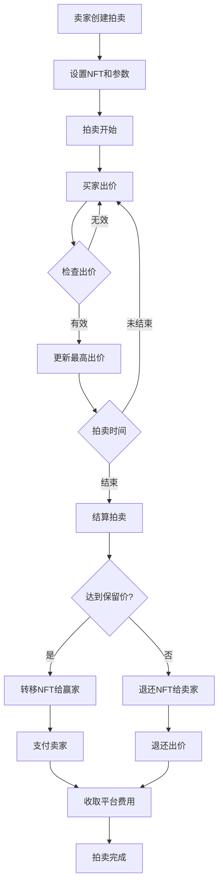

# NFT 拍卖平台 - 完整实现方案

## 项目概述

这是一个基于 Solidity 的去中心化 NFT 拍卖平台，支持多种代币出价、Chainlink 价格预言机、UUPS 升级模式、工厂模式部署和跨链功能。

## 核心功能特性

### 🏛️ 核心拍卖功能
- ✅ **多种拍卖类型**：英式拍卖、荷兰式拍卖、密封出价拍卖
- ✅ **多代币支付**：支持 ETH 和任意 ERC20 代币出价
- ✅ **智能定价**：集成 Chainlink 价格预言机，实时美元计价
- ✅ **保留价格**：设置最低成交价格保护卖家利益
- ✅ **一口价购买**：支持即时购买功能
- ✅ **自动延时**：拍卖最后15分钟出价自动延长

### 🔮 价格预言机集成
- ✅ **Chainlink 价格预言机**：获取实时代币价格
- ✅ **多币种支持**：ETH/USD、USDT/USD 等价格对
- ✅ **价格转换**：自动将不同代币出价转换为美元计价
- ✅ **模拟预言机**：开发测试环境使用

### 🏭 工厂模式部署
- ✅ **拍卖工厂**：批量创建和管理拍卖平台
- ✅ **默认配置**：自动配置价格预言机和参数
- ✅ **平台管理**：统一管理多个拍卖平台实例
- ✅ **批量操作**：支持批量升级和配置更新

### 🔄 UUPS 升级模式
- ✅ **可升级合约**：使用 OpenZeppelin UUPS 代理模式
- ✅ **版本管理**：V1/V2 版本功能对比
- ✅ **平滑升级**：保持数据完整性的合约升级
- ✅ **权限控制**：仅合约所有者可执行升级

### 🌉 跨链支持 (实验性)
- ✅ **Chainlink CCIP**：跨链通信协议集成
- ✅ **跨链拍卖**：支持在不同链上创建和参与拍卖
- ✅ **消息传递**：拍卖状态跨链同步
- ✅ **多链管理**：统一管理多条链上的拍卖

### 🔒 安全特性
- ✅ **重入攻击防护**：ReentrancyGuard 保护
- ✅ **权限控制**：基于角色的访问控制
- ✅ **输入验证**：全面的参数验证和边界检查
- ✅ **资金安全**：自动退款和平台费用管理

## 技术架构

### 合约结构

```
contracts/task3/
├── AuctionNFT.sol              # ERC721 NFT 合约
├── NFTAuctionPlatform.sol      # 主拍卖平台合约 (V1)
├── NFTAuctionPlatformV2.sol    # 升级版拍卖平台 (V2)
├── NFTAuctionFactory.sol       # 拍卖工厂合约
├── CrossChainAuctionBridge.sol # 跨链桥接合约
└── MockPriceFeed.sol          # 测试用价格预言机
```

### 核心技术栈

- **Solidity ^0.8.22** - 智能合约开发语言
- **Hardhat 2.x** - 开发框架和工具链
- **OpenZeppelin** - 安全的合约库
  - ERC721 标准 NFT 实现
  - UUPS 可升级代理模式
  - Access Control 权限管理
  - ReentrancyGuard 重入保护
- **Chainlink** - 预言机和跨链服务
  - Price Feeds 价格预言机
  - CCIP 跨链通信协议
- **hardhat-deploy** - 部署管理插件

### 拍卖流程



## 快速开始

### 1. 环境准备

```bash
# 克隆项目
git clone <项目地址>
cd solidityTest

# 安装依赖
npm install

# 编译合约
npx hardhat compile
```

### 2. 部署到本地网络

```bash
# 启动本地节点
npx hardhat node

# 部署合约 (新终端)
npx hardhat run scripts/deploy-task3.js --network localhost
```

### 3. 运行测试

```bash
# 运行所有测试
npx hardhat test test/task3-auction-platform.js

# 运行特定测试
npx hardhat test test/task3-auction-platform.js --grep "基础拍卖功能"
```

## 合约接口详解

### NFTAuctionPlatform (主拍卖合约)

#### 核心函数

```solidity
// 创建拍卖
function createAuction(
    uint256 duration,      // 拍卖时长(秒)
    uint256 startPrice,    // 起始价格(USD, 18位小数)
    uint256 reservePrice,  // 保留价格(USD, 18位小数)
    address nftAddress,    // NFT合约地址
    uint256 tokenId        // NFT Token ID
) external returns (uint256 auctionId);

// ETH出价
function placeBidWithETH(uint256 auctionId) external payable;

// ERC20代币出价
function placeBidWithToken(
    uint256 auctionId,
    address tokenAddress,
    uint256 amount
) external;

// 结束拍卖
function endAuction(uint256 auctionId) external;

// 获取拍卖信息
function getAuction(uint256 auctionId) external view returns (Auction memory);
```

#### 主要事件

```solidity
event AuctionCreated(uint256 indexed auctionId, address indexed seller, ...);
event BidPlaced(uint256 indexed auctionId, address indexed bidder, ...);
event AuctionEnded(uint256 indexed auctionId, address indexed winner, ...);
```

### NFTAuctionFactory (工厂合约)

```solidity
// 创建拍卖平台
function createAuctionPlatform() external returns (address auctionPlatform);

// 添加默认价格预言机
function addDefaultPriceFeed(address token, address priceFeed) external;

// 获取用户创建的平台
function getUserAuctions(address user) external view returns (address[] memory);
```

### NFTAuctionPlatformV2 (升级版)

新增功能：
- 荷兰式拍卖（递减价格）
- 密封出价拍卖
- 一口价购买
- 批量创建拍卖
- 增强的统计功能

## 使用示例

### 创建和参与拍卖

```javascript
// 获取合约实例
const factory = await ethers.getContractAt("NFTAuctionFactory", factoryAddress);
const platform = await ethers.getContractAt("NFTAuctionPlatform", platformAddress);
const nft = await ethers.getContractAt("AuctionNFT", nftAddress);

// 1. 铸造NFT
await nft.mint(seller.address, "unique-token-uri");

// 2. 授权拍卖平台
await nft.setApprovalForAll(platform.address, true);

// 3. 创建拍卖 (24小时, 起始价$100, 保留价$150)
const auctionId = await platform.createAuction(
    24 * 60 * 60,                    // 24小时
    ethers.utils.parseEther("100"),  // $100 起始价
    ethers.utils.parseEther("150"),  // $150 保留价
    nft.address,
    1                                // Token ID
);

// 4. 使用ETH出价 (假设ETH=$2000, 出价0.1ETH=$200)
await platform.connect(bidder).placeBidWithETH(auctionId, {
    value: ethers.utils.parseEther("0.1")
});

// 5. 使用USDT出价 ($250)
await usdt.connect(bidder).approve(platform.address, ethers.utils.parseEther("250"));
await platform.connect(bidder).placeBidWithToken(
    auctionId,
    usdt.address,
    ethers.utils.parseEther("250")
);

// 6. 结束拍卖
await platform.endAuction(auctionId);
```

### 升级合约

```javascript
// 部署V2实现合约
const NFTAuctionPlatformV2 = await ethers.getContractFactory("NFTAuctionPlatformV2");
const v2Implementation = await NFTAuctionPlatformV2.deploy();

// 升级到V2 (需要是平台所有者)
await platform.upgradeToAndCall(v2Implementation.address, "0x");

// 初始化V2功能
const platformV2 = await ethers.getContractAt("NFTAuctionPlatformV2", platform.address);
await platformV2.initializeV2();

// 使用V2新功能 - 创建一口价拍卖
await platformV2.createAuctionV2(
    24 * 60 * 60,                    // 24小时
    ethers.utils.parseEther("100"),  // 起始价$100
    ethers.utils.parseEther("150"),  // 保留价$150
    nft.address,
    2,                               // Token ID
    0,                               // 英式拍卖
    ethers.utils.parseEther("200"),  // 一口价$200
    ethers.utils.parseEther("10"),   // 最小加价$10
    []                               // 无代币白名单
);
```

## 配置和部署

### 网络配置

更新 `hardhat.config.js`:

```javascript
module.exports = {
    networks: {
        localhost: {
            url: "http://127.0.0.1:8545"
        },
        sepolia: {
            url: process.env.SEPOLIA_URL,
            accounts: [process.env.PRIVATE_KEY]
        },
        polygon: {
            url: process.env.POLYGON_URL,
            accounts: [process.env.PRIVATE_KEY]
        }
    },
    // ... 其他配置
};
```

### 环境变量

创建 `.env` 文件：

```bash
SEPOLIA_URL=https://sepolia.infura.io/v3/YOUR_KEY
POLYGON_URL=https://polygon-mainnet.infura.io/v3/YOUR_KEY
PRIVATE_KEY=your_private_key_here
ETHERSCAN_API_KEY=your_etherscan_api_key
```

### 价格预言机配置

主网价格预言机地址 (Chainlink):

```javascript
const PRICE_FEEDS = {
    // Ethereum Mainnet
    ETH_USD: "0x5f4eC3Df9cbd43714FE2740f5E3616155c5b8419",
    USDT_USD: "0x3E7d1eAB13ad0104d2750B8863b489D65364e32D",
    USDC_USD: "0x8fFfFfd4AfB6115b954Bd326cbe7B4BA576818f6",
    
    // Polygon
    ETH_USD_POLYGON: "0xF9680D99D6C9589e2a93a78A04A279e509205945",
    USDT_USD_POLYGON: "0x0A6513e40db6EB1b165753AD52E80663aeA50545"
};
```

## 测试覆盖

### 测试类别

1. **基础功能测试**
   - 拍卖创建和配置
   - ETH 和 ERC20 出价
   - 拍卖结算和 NFT 转移

2. **价格预言机测试**
   - 多币种价格转换
   - 价格更新和实时查询

3. **工厂模式测试**
   - 多平台创建和管理
   - 默认配置应用

4. **升级功能测试**
   - V1 到 V2 平滑升级
   - 数据迁移和兼容性

5. **安全性测试**
   - 权限验证
   - 重入攻击防护
   - 边界条件测试

6. **事件和状态测试**
   - 事件正确触发
   - 状态转换验证

### 运行测试

```bash
# 完整测试套件
npm test

# 带覆盖率报告
npx hardhat coverage

# 气体使用分析
npx hardhat test --reporter eth-gas-reporter
```

## 安全考虑

### 已实现的安全措施

1. **重入攻击防护** - 使用 ReentrancyGuard
2. **权限控制** - Ownable 和基于角色的访问控制
3. **输入验证** - 全面的参数验证
4. **整数溢出保护** - Solidity 0.8+ 内置保护
5. **价格操作防护** - 价格预言机去中心化
6. **资金安全** - 自动退款机制

### 建议的额外安全措施

1. **多重签名** - 关键操作使用多重签名
2. **时间锁** - 升级操作添加时间延迟
3. **审计** - 主网部署前进行专业审计
4. **监控** - 实时监控异常交易
5. **保险** - 考虑智能合约保险

## 进阶功能

### V2 版本新功能

1. **荷兰式拍卖**
   ```solidity
   // 价格随时间递减的拍卖
   function getDutchAuctionCurrentPrice(uint256 auctionId) external view returns (uint256);
   ```

2. **密封出价拍卖**
   ```solidity
   // 提交加密出价承诺
   function commitSealedBid(uint256 auctionId, bytes32 commitment) external payable;
   
   // 揭示真实出价
   function revealSealedBid(uint256 auctionId, uint256 bidAmount, address bidToken, uint256 nonce) external;
   ```

3. **批量操作**
   ```solidity
   // 批量创建拍卖
   function batchCreateAuctions(BatchCreateParams calldata params) external returns (uint256[] memory);
   ```

4. **增强统计**
   ```solidity
   // 获取拍卖统计信息
   function getAuctionStats(uint256 auctionId) external view returns (AuctionStats memory);
   ```

### 跨链功能 (实验性)

使用 Chainlink CCIP 实现跨链拍卖：

```solidity
// 跨链创建拍卖
function createCrossChainAuction(
    uint64 destinationChainSelector,
    CrossChainAuctionData memory auctionData
) external returns (bytes32 messageId);

// 跨链出价
function placeCrossChainBid(
    uint64 destinationChainSelector,
    CrossChainBidData memory bidData
) external returns (bytes32 messageId);
```

## 部署清单

### 主网部署步骤

1. **准备阶段**
   - [ ] 代码审计完成
   - [ ] 测试网全面测试
   - [ ] 价格预言机地址确认
   - [ ] 多重签名钱包准备

2. **部署阶段**
   - [ ] 部署 NFT 合约
   - [ ] 部署工厂合约
   - [ ] 配置价格预言机
   - [ ] 创建拍卖平台
   - [ ] 权限转移

3. **验证阶段**
   - [ ] 合约验证 (Etherscan)
   - [ ] 功能测试
   - [ ] 前端集成测试
   - [ ] 安全检查

## 贡献指南

### 开发环境

1. Node.js >= 16.0.0
2. Git
3. VS Code (推荐)

### 代码规范

- 使用 Prettier 格式化
- 遵循 Solidity Style Guide
- 100% 测试覆盖率
- 详细的注释和文档

### 提交流程

1. Fork 项目
2. 创建功能分支
3. 添加测试用例
4. 确保测试通过
5. 提交 Pull Request

## 许可证

MIT License - 详见 [LICENSE](LICENSE) 文件

## 联系方式

- 项目地址: [GitHub Repository]
- 问题反馈: [Issues]
- 文档地址: [Documentation]

---

**注意**: 这是一个演示项目，主网部署前请进行专业安全审计。